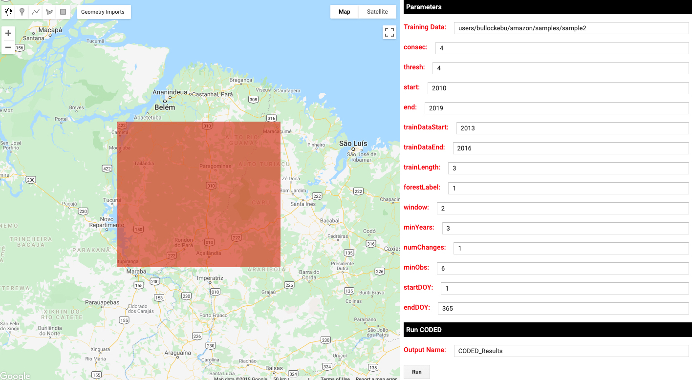
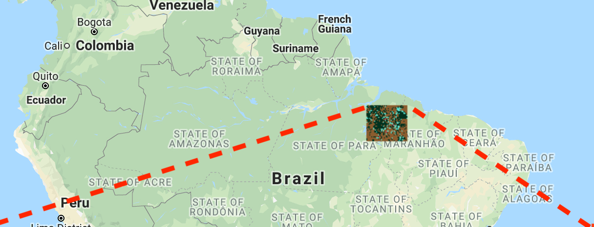
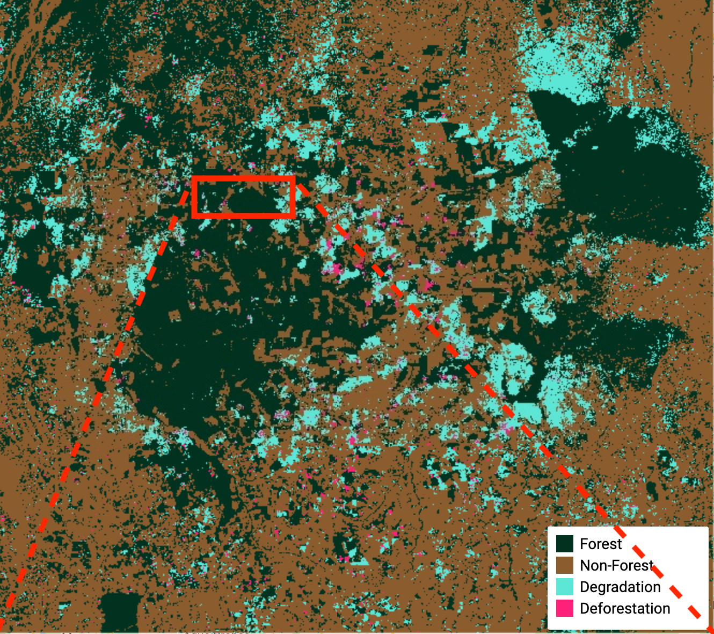
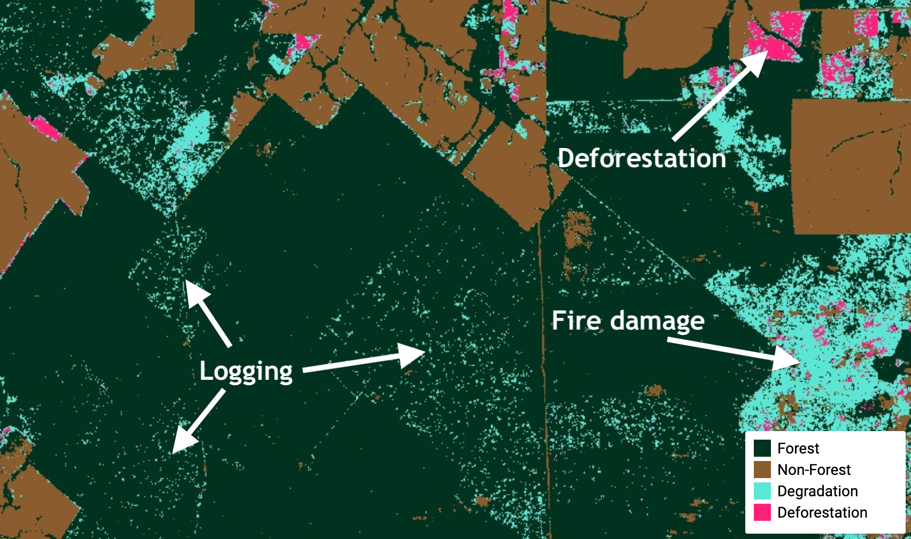

# Estimating Area of Deforestation and Degradation using AREA2 and CODED


By Eric Bullock (bullocke@bu.edu)

---

# Part 1: Running CODED

## 1.1 The Disturbance Dataset
A tutorial on running CODED using the Javascript interface can be found [here](https://coded.readthedocs.io/en/latest/running.html). This process can be easily facilitated using the user interface provided in the CODED repository in 'coded/apps/Submit CODED UI'.



The parameters used for this tutorial are shown in the image above, and a task for running CODED can be submitted by clicking the 'Run' button. The study region can be defined by drawing a square polygon in the 'region' geometry import. Note that this must be a single polygon, and must be contained in the 'region' geometry. 

The training data used in this analysis can be found in the feature collection: 'users/bullockebu/amazon/samples/sample2'

## 1.2 Stratification

In cases in which the classes of interest are small relative to the study region it is generally recommended to use a <a class="ui-tooltip" title="When “simple random sampling is taken in each stratum” (Cochran 1977, p. 89)."><span style="cursor: help;"><i>stratified random sample</i></span></a> design. A <a class="ui-tooltip" title="“A method for selecting n units out of the 𝑁 such that every one of [the sets of 𝑛 specified units] has an equal chance of being drawn.” (Cochran 1977, p. 18)."><span style="cursor: help;"><i>simple random sample</i></span></a> is technically possible but would be less efficient. For this exercise we are assuming that the class of interest is <a class="ui-tooltip" title="A forest disturbance that reduces the ecological capacity of the forest but does not result in a change in land cover."><span style="cursor: help;"><i>degradation</i></span></a>, which is often small in area compared to stable land covers. Therefore, we will be using a stratified random design for sampling and estimation. 

The only input needed for this tutorial is a <a class="ui-tooltip" title="Strata are “subpopulations that are non-overlapping, and together comprise the whole population” (Cochran, 1977, p. 89)"><span style="cursor: help;"><i>strata</i></span></a> map. In our case the strata are Forest, Non-Forest, Deforestation, and Degradation. The <a class="ui-tooltip" title="“The aggregate [that we want to obtain information about] from which the sample is chosen” (Cochran, 1977, p. 5)."><span style="cursor: help;"><i>population</i></span></a> consists of the pixels in the map, and we will use <a class="ui-tooltip" title="The reference classification applied to the collection of all sample units."><span style="cursor: help;"><i>reference observations</i></span></a> to estimate the proportions of the population that are from our four classes.   

Note that this map should be treated as a stratification: a simple map made with little care for resolving errors and for the primary purpose for stratifying a sample. The CODED results can be turned into a stratification using a few simple heuristic rules for defining the classes. The forest and non-forest classes are the land cover classification of areas without a forest disturbance. 

```javascript
// The results are masked in areas of non change, so first unmask
var unmasked = image.unmask()

// Get each stratum and assign correct label
var forest = unmasked.select('forest_2010').eq(1)
  .and(unmasked.select('dist_1').eq(0))
  
var nonForest = unmasked.select('forest_2010').neq(1)
  .and(unmasked.select('dist_1').eq(0)).remap([1],[2]) 
```

Some areas do not have enough observations after the disturbance to classify as forest/non-forest and therefore do not have a disturbance type. We can either ignore these pixels or use a threshold on the change magnitude as a proxy for deforestation. Here we will use a threshold of 20 to do differentiate degradation and deforestation.

```javascript
var magThreshold = 20

var degradation = unmasked.select('post_1').eq(1)
  .or(unmasked.select('mag_1').lte(magThreshold))
  .remap([1],[3])

var deforestation = unmasked.select('post_1').gt(1)
  .or(unmasked.select('mag_1').gt(magThreshold))
  .remap([1],[4])
  
// Combine the strata into a single band image 
var strata = ee.Image.cat([forest,nonForest,degradation,deforestation])
  .selfMask()
  .reduce(ee.Reducer.firstNonNull())

// Create an image palette and add to display
var imagePalette = ['#013220', '#8b5d2e', '#5CE5D5','#FF2079']
var strata = ee.Image('projects/AREA2/bullocke/amazon/Amazon_Example_Strata')
Map.addLayer(strata, {min: 1, max: 4, palette: imagePalette}, 'Stratification')
```




## Next part: Sample Design and Reference Interpretation

[Part 2: Sample Design and Interpretation](sample.md) 
