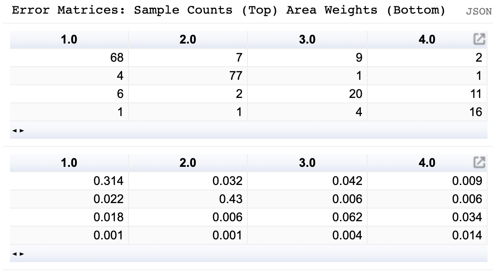
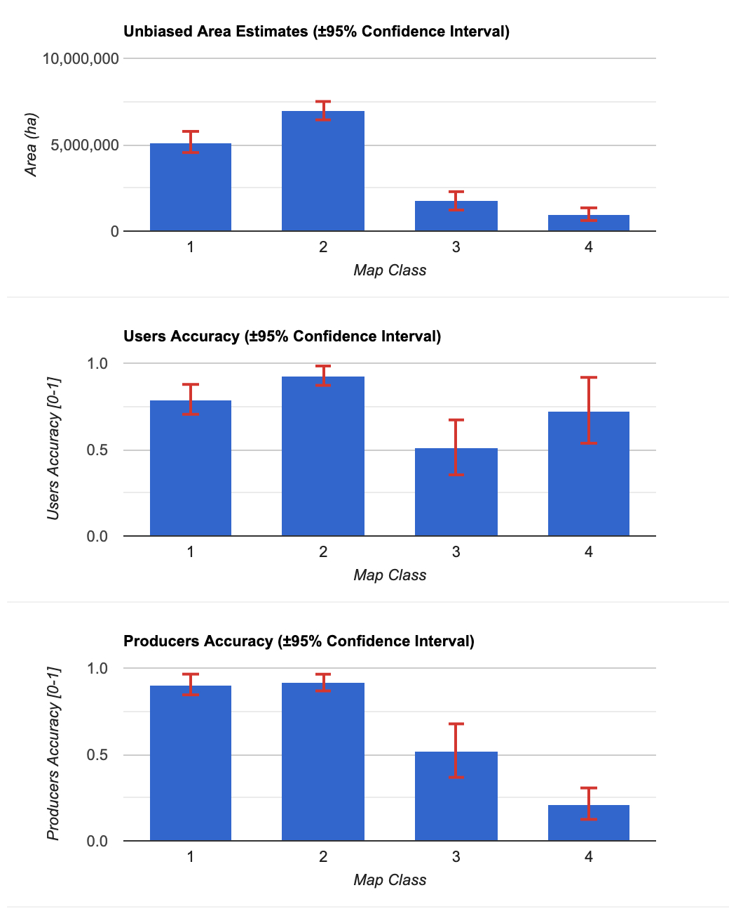
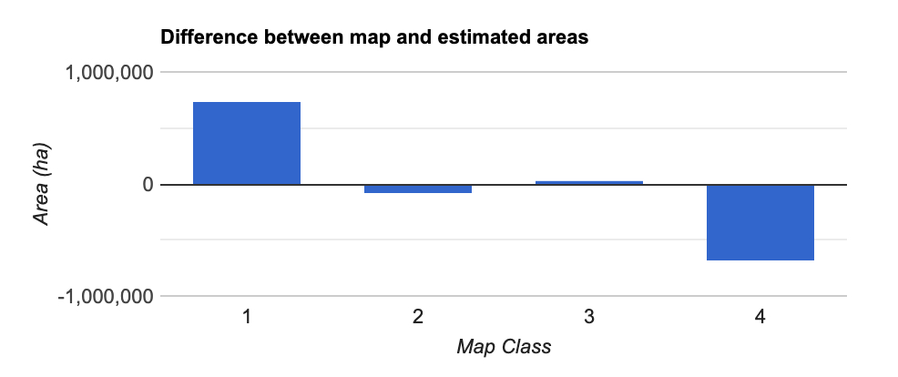
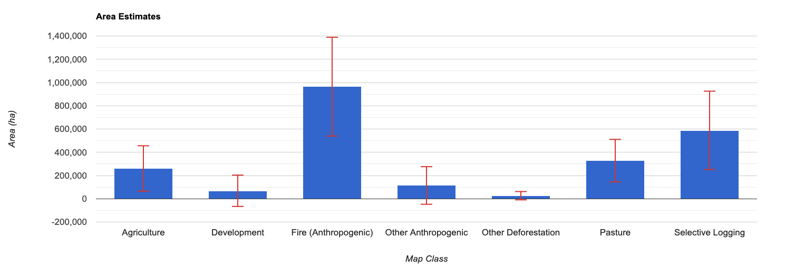
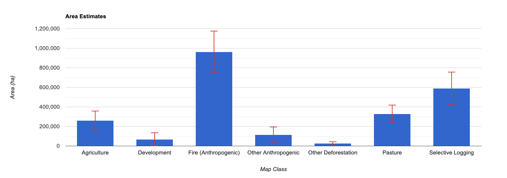

# Estimating Area of Deforestation and Degradation using AREA2 and CODED


By Eric Bullock (bullocke@bu.edu)

The stratified estimator of a mean can be expressed as:

$$\ \hat{A}_j = A_{tot} \Sigma_i W_i \frac{n_{ij}}{n_i}$$ 

The interpreted reference sample can now be used to estimate accuracy and area using a stratified estimator. This process is facilitated by the 'stratifiedEstimator' function, which takes a single dictionary containing inputs:

```
/** 
* Stratified estimator from:
*    Cochran, W. G. (2007). Sampling techniques. John Wiley & Sons.
*    Olofsson, P., Foody, G. M., Stehman, S. V., & Woodcock, C. E. (2013). Making 
*      better use of accuracy data in land change studies: Estimating accuracy and 
*      area and quantifying uncertainty using stratified estimation. Remote Sensing of 
*      Environment, 129, 122-131.
* 
* 
* Estimate mean, variance, and map accuracies derived from a stratified random sample. 
* 
* 
* 
* @param   {Dictionary}  options          parameter object
*   @key   {ee.Image}    stratifiedMap    strata map from which the samples were derived
*   @key   {ee.FC}       referenceSample  reference sample with labels provided in properties
*   @key   {String}      referenceLabel   property name of reference labels
*   @key   {Number}      scale            spatial resolution to operate on. If null the resolution is calculated
*   @key   {Boolean}     accuracy         compute map accuracy in addition to areas  
* 
* 
* @returns {Dictionary}  output           Dictionary containing estimates
*   @key   {Dictionary}  accuracies       overall, users, and producers accuracies and standard errors
*   @key   {Dictionary}  areas            estimated areas and standard errors
*   @key   {Dictionary}  errorMatrices    confusion matrices in sample counts and area proportions
*   @key   {Dictionary}  inputs           derived input parameters from map and reference data
*/  

```


As can be seen in the documentation, the function takes a single dictionary defining the parameters and returns a dictionary containing the estimates and error matrices. 

```
var estimators = require('projects/AREA2/public:utilities/estimators')

// Define path to sample with reference labels
var referenceLabels = ee.FeatureCollection('projects/AREA2/bullocke/amazon/bullocke_11_12_2019_2')

var estimates = estimators.stratifiedEstimator(
  {stratifiedMap: strata,
  referenceSample: referenceLabels,
  referenceLabel: 'reference',
  accuracy: true
})

print(estimates)
```

In the console you will see a dictionary containing the resulting estimates. The AREA2 repo also containings a plotting module to visualize the results. Note that by transposing the matices the tables are displayed in the typical format, with columns representing reference labels and rows the strata labels:

```
var plotting = require('projects/AREA2/public:utilities/plotting')
print('Error Matrices: Sample Counts (Top), Area Weights (Bottom)')
plotting.makeTable({matrix: ee.Array(estimates.errorMatrices.sampleCounts).transpose(),
                    title: 'Sample Counts'})

plotting.makeTable({matrix: ee.Array(estimates.errorMatrices.areaProportions).transpose(),
                    title: 'Sample Counts'})

```

In the console you will see two error matrices:



Similarly the plotting module can plot bar plots with error bars to display the estimates of area and accuracy:

```
plotting.doBar({plotType: 'areaEstimates', results: estimates})
plotting.doBar({plotType: 'users', results: estimates})
plotting.doBar({plotType: 'producers', results: estimates})
plotting.doBar({plotType: 'mapBias', results: estimates})
```




Note a few things about these estimates:

<b>First and importantly, these estimates are unbiased with measures of uncertainty expressed as confidence intervals.</b> For the forest and non-forest classes, the area estimates have relatively high precision. The disturbance classes are estimated with lower precision but are still statistically significant. The disturbance classes have lower precision to due sample units labeled as change in the reference data but from a stable map strata. Or in other words, map errors. Errors are common due to the inherent difficulty in translating reflected sunlight to surface processes, especially with regards to degradation. The next section will go over ways of improving the precision in the estimates despite these difficulties.

<b>The overall accuracy of the map was 82%, while the User's Accuracies and Producer's Accuracies ranged from 51% to 93% and 23% to 92%, respectively.</b> Depending on your objective, <b>specific measures of accuracy may or may not be relevant</b>. For example, if your objective is to use the map product for spatial analysis strictly to due with deforestation, providing an overall accuracy would not effectively characterize the map accuracy of the deforestation class, which is 51% (the User's Accuracy). The low Producer's accuracy of deforestation was low due to errors of omission. However, 11 of the 14 errors of omission of deforestation were from the degradation class, indicating that the disturbance was found but classified incorrectly. The Producer's Accuracy is improved if you combine the two disturbance classes (~64%) 

<b>The areas calculated from the sample data and stratified estimator were not statistical different than the map areas for the degradation and non-forest classes.</b> However, the map significantly overrepresented stable forest and underrepresented deforestation. The statistical estimator accounted for this bias, which is why these results represent unbiased area estimates. 

## 2.4 Improving Precision

These results were created quickly for this tutorial, and might not be satisfactory for scientific analysis. Precision in the estimates can be improved by increasing the sample size. To demonstrate this we can calculate the standard error standard error of degradation with the sample presented above, and with the same sample but with the sample units used twice in the stratified estimator:

```

var referenceLabels = ee.FeatureCollection('projects/AREA2/bullocke/amazon/bullocke_11_12_2019_3')
var estimates = estimators.stratifiedEstimator(
  {stratifiedMap: strata,
  referenceSample: referenceLabels,
  referenceLabel: 'reference'
  scale: 30
})
print('Area: 1x sample',
  ee.Dictionary(estimates.areas.estimates.proportions).get('3'))
print('Standard Error: 1x sample',
  ee.Dictionary(estimates.areas.standardErrors.proportions).get('3.0'))

```

In the console you will see the area estimate is 0.117, and standard error is 0.018. Now double the sample units (this is just to demonstrate the influence of sample size. In actual analysis, this should be done from the first derivation of the sample!)

```
// Double the sample units
referenceLabels = referenceLabels.merge(referenceLabels)  
var estimates = estimators.stratifiedEstimator(
  {stratifiedMap: strata,
  referenceSample: referenceLabels,
  referenceLabel: 'reference',
  scale: 30
})
print('Area: 2x sample',
  ee.Dictionary(estimates.areas.estimates.proportions).get('3'))

print('Standard Error: 2x sample',
  ee.Dictionary(estimates.areas.standardErrors.proportions).get('3.0'))
```

You will see the area estimate does not change, however the standard error is reduced to 0.013. This represents a 28% reduction in the standard error. 

# Part 3: Calculating Activity Factors

Finally, this sample can be used to estimate specific disturbance types or drivers, as long as that information was saved during reference interpretation. Using the tool demonstrated here, the disturbance type is saved in the attribute 'refDistType'. A little data management is necessary to convert the attribute from string values to numeric so that it will work with the estimator. You can then apply the sample to the estimator, without the flag to calculate accuracies as the reference labels no longer correspond to the strata labels. 

```
// Remap reference disturbance type so it's numeric
var distTypes = ee.Dictionary(referenceLabels.aggregate_histogram('refDistType'))

// Save the keys so we can use them later
var distTypeKeys = distTypes.keys()
referenceLabels = referenceLabels.remap(
  distTypeKeys,
  [0,1,2,3,4,5,6,7],
  'refDistType')

// Apply the sample to the stratified estimator
var estimates = estimators.stratifiedEstimator(
  {stratifiedMap: strata,
  referenceSample: referenceLabels,
  referenceLabel: 'refDistType',
  scale: 30,
})

// Plot the area estimates with the original labels and without the stable class
plotting.doBar({
  plotType: 'areaEstimates', 
  results: estimates, 
  remove: ["0"],
  classLabels: distTypeKeys.removeAll([distTypeKeys.get(0)])
})
```



Note that, as before, the confidence intervals can be reduced with a larger sample size. The 95% confidence interval for Development, Other Anthropogenic, and Other Deforestation are not statistically different than 0. 

Once again, we can <b>simulate</b> the effect of an increase in sample size by duplicating the reference samples. Note the increase in precision (or decreasing in confidence intervals) when duplicating the reference samples 3 times, to get a total sample of 920 sample units. Doing this can guide the development of future sample designs in order to reach a desired level of precision.

```javascript
var referenceLabels = ee.FeatureCollection('projects/AREA2/bullocke/amazon/bullocke_11_12_2019_2')
referenceLabels = referenceLabels.merge(referenceLabels).merge(referenceLabels).merge(referenceLabels)

// Remap reference disturbance type so it's numeric
var distTypes = ee.Dictionary(referenceLabels.aggregate_histogram('refDistType'))

var distTypeKeys = distTypes.keys()
referenceLabels = referenceLabels.remap(
  distTypeKeys,
  [0,1,2,3,4,5,6,7],
  'refDistType')

var estimates = estimators.stratifiedEstimator(
  {stratifiedMap: strata,
  referenceSample: referenceLabels,
  referenceLabel: 'refDistType',
  scale: 30,
  // accuracy: true
})
```


