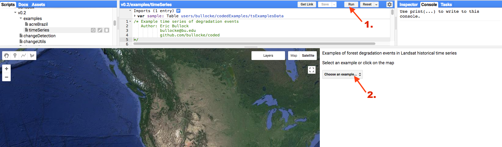
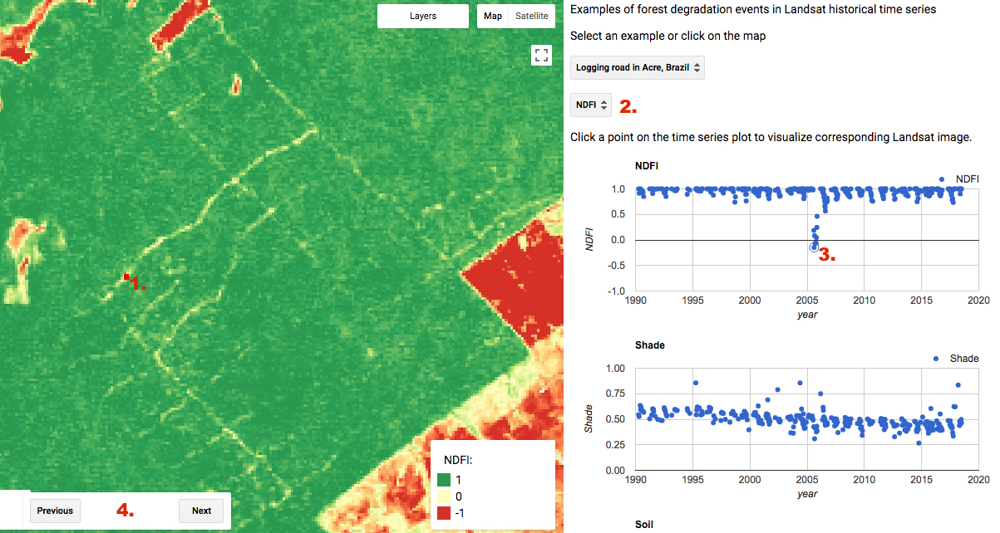

Timeseries Examples
===================

Example of degradation events and their corresponding Landsat time series can be found in the `javascript repository`_ in the file 'coded/examples/1. Timeseries Examples'. The code can be run by selecting 'Run' at the top of the page (1 in figure below), then choosing an example in the drop down menu (2). 

.. _javascript repository: https://code.earthengine.google.com/?accept_repo=users/bullocke/coded

The map will center on the location of degradation and a red point will appear on the map corresponding to the time series displayed in the panel (1 in figure below). Each data point in the time series plot represent a single observation. Optionally, you can choose the image stretch for when Landsat images are loaded (2). The Landsat images can be loaded by clicking on a data point in one of the time series (3). The examples can be quickly navigated using the 'previous' and 'next' buttons (4). 

