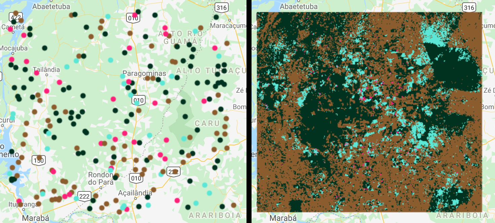
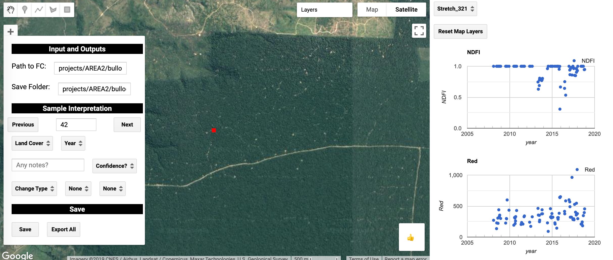
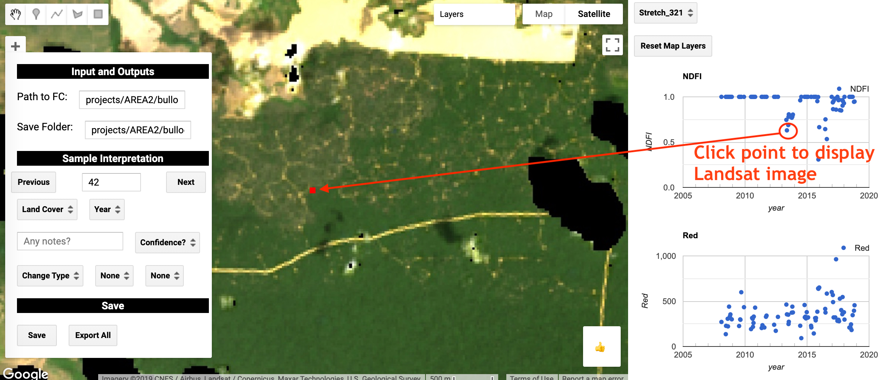
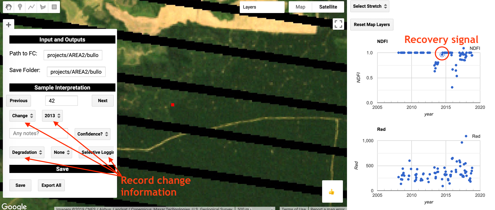
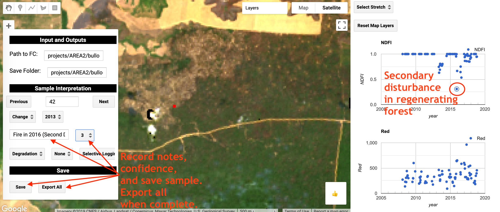

# Estimating Area of Deforestation and Degradation using AREA2 and CODED


By Eric Bullock (bullocke@bu.edu)

---

# Part 2: Area and Accuracy Estimation. 

## 2.1 Creating the sample


The goal of this exercise is to estimate the area of deforestation and degradation with <a class="ui-tooltip" title="A 95% confidence interval for a population parameter, 𝜇, expresses uncertainty in the parameter estimate, 𝜇̂ , and is calculated using the sample data. Confidence intervals are often, but not necessarily, in the form 𝜇̂ ±𝑎×SE(𝜇̂ ) where SE(𝜇̂ ) is the standard error of the estimate and 𝑎 is a statistic related to the desired confidence level (see z-score). Among the aggregate set of confidence intervals constructed using all samples that could be realized using the sampling design, 95% of such intervals are expected to include the true value of the population parameter 𝜇 , although which intervals do and which do not include 𝜇 is generally unknown. The IPCC Good Practice Guidelines (IPCC, 2006, Section 3.1.3) recommend the use of 95% confidence intervals in greenhouse gas inventories."><span style="cursor: help;"><i>confidence intervals</i>.</span></a>. These estimates are not as useful if the confidence intervals are large, or in other words if the estimates have low <a class="ui-tooltip" title="In the context of estimation, Cochran (1977, p. 16) states that because “of the difficulty of ensuring that no unsuspected bias enters into estimates [sic], we will usually speak of the precision of an estimate instead of its accuracy. Accuracy refers to the size of deviations from the true mean math:mu, whereas precision refers to the size of deviations from the mean m obtained by repeated application of the sampling procedure.” In the context of this document, we often characterize the precision of an estimate with a 95% confidence interval – the larger the interval the less the precision (and greater the uncertainty)."><span style="cursor: help;"><i>precision</i></span></a>. Therefore, we seek to design a <a class="ui-tooltip" title="A subset of population units selected from the population."><span style="cursor: help;"><i>sample</i></span></a> that ensures we can meet a target level of precision. To calculate the total sample size *n* we can use Equation 5.25 in Cochran 1977:

$$\ n \approx \left(\frac{\Sigma W_i S_i}{S\hat({P})}\right)^2$$

where,

$$\ S_i = \sqrt{p_i(1 - p_i)}$$

S<sub>i</sub> = <a class="ui-tooltip" title="The standard error is the standard deviation (i.e. square root of the variance) of an estimator (Rice, 1995, p. 192)."><span style="cursor: help;"><i>Standard error</i></span></a> for stratum *i*

W<sub>i</sub> = <a class="ui-tooltip" title="The proportional area of a stratum as it relates to total area of the stratification."><span style="cursor: help;"><i>Area weight</i></span></a> for stratum *i*

p<sub>i</sub> = Proportion of the target class in stratum *i*

S($$\hat{P}$$) = Target standard error of target class

We have helper functions for doing these calculations in the AREA2 repository, the first of which is for creating a list of the area weights. The following code will load utility functions and get a list of area weights: 

```
var sampleUtils = require('projects/AREA2/public:utilities/sampling')
var miscUtils = require('projects/AREA2/public:utilities/misc')

var areaInfo = ee.Dictionary(miscUtils.getAreaWeights(strata))
var areaWeights = ee.Dictionary(areaInfo.get('areaWeights'))

var areaList = areaWeights.keys().map(function(key) {
  return areaWeights.get(key)
})
``` 

The parameters noted above should be approximated by using previous studies or knowledge. In our case, we will target Degradation, a class that has historically been proven difficult to reliably map<sup>5</sup>. Therefore, we will assume a target <a class="ui-tooltip" title="From Stehman (1997, p. 79): “User’s accuracy for [category] i [is] the conditional probability that an area classified as category i by the map is classified as category i by the reference data”. When expressed in terms of area, user’s accuracy is the proportion of the area that has the predicted class of the category of interest that is correctly classified as determined by comparison to the reference classification. For a simple random sample of reference observations, each of which represents an equal area, user’s accuracy is estimated by dividing the number of correctly classified map units in each category by the total number of units classified into that category (Lillesand et al., 2008, p. 586). User’s accuracy is the complement of commission error (Olofsson et al., 2013)."><span style="cursor: help;"><i>user's accuracy</i></span></a>  of 60%, with 1 <a class="ui-tooltip" title="Omission error is the proportion or percentage of area with the reference classification of the category of interest that is erroneously predicted (mapped) to be in other categories. Omission error is the complement of producer’s accuracy (Olofsson et al., 2013)."><span style="cursor: help;"><i>error of omission</i></span></a> per 100 <a class="ui-tooltip" title="Entities that make up the sampling frame (Särndal et al., 1992, p.5). In the literature, sometimes there is no distinction made between population units and sampling units (e.g. Cochran, 1977, p. 6). However, population and samplings units are different entities because the sampling frame and the population are sometimes different entities (in many situations though, the sampling frame is equivalent to the population)."><span style="cursor: help;"><i>sample units</i></span></a> from each stable class and 10 in the deforestation class. Note that these are rather optimistic assumptions, given the inherent difficulty in accurately mapping
degradation. Regardless, this should give us a reasonable sample size for this exercise. Solving the equation for the number of sample units gives us:

$$\ n \approx \left(\frac{(0.1 * 0.39) + (0.1 * 0.46) + (0.49 * 0.12) + (0.3 * 0.02)}{0.01}\right)^2 = 224 \text{ sample units} $$

The sample utility module has a function for calculating the equation above, however it assumes the inputs are all javascript
arrays. The following code asynchronously retrieves the area weights, solves the equation for the *n*, and prints an allocation that would be based on the proportional area of each stratum: 

```
var classList = [1, 2, 3, 4]
var targetUsers = .6
var propTarget = [.01, .01, targetUsers, .1]
var targetSE = .01

areaList.evaluate(function(jScriptList) {
  var sampleCount = sampleUtils.strClassArea(classList,propTarget,jScriptList, targetSE)
  print('Recommended sample count: ', sampleCount)
  
  var propAllocation = jScriptList.map(function(stratum) {
    return ee.Number(stratum).multiply(ee.Number(sampleCount))
  })
  
  print('Proportional allocation: ', propAllocation)
})
``` 

As displayed on the dashboard, the recommended sample size is 226 total sample units, which, slightly different than when calculated by hand due to rounding. If allocated proportional to strata areas, this gives 90 sample units to the Forest stratum, 105 in the Non Forest, 27 in Degradation, and 4 in Deforestation. "Good practice"<sup>6</sup> recommends no less than 30 sample units for a class you wish to estimate, with proportional allocation to the remaining samples. Using good practice allocation results in 90, 80, 30, and 30 sample units for the Forest, Non Forest, Degradation, and Deforesation classes, respectively. The Earth Engine ['stratifiedSample'](https://developers.google.com/earth-engine/api_docs#ee.image.stratifiedsample) function can then be used to select a sample. The following code creates a sample, shuffles their order, and adds them to map:

```
var allocation = [90,80,30,30]

var sample = strata.rename('strata').stratifiedSample({
   numPoints: 0, // 0 points for pixel values not in 'allocation'
   classValues: classList, // pixel values
   classPoints: allocation, // sample allocation 
   scale: 30, // Landsat spatial resolution
   geometries: true
})

// Shuffle it so they are in random order and have an ID attribute
sample = sampleUtils.shuffle(sample)

// Assign property for visualizing
var imagePalette = ['#013220', '#8b5d2e', '#5CE5D5','#FF2079']
var sampleWithColor = sample.map(function(i) {
  var sampleClass = ee.Number(i.get('strata')).subtract(1) // Using the class number as an index
  return i.set('color', {
    color: ee.List(imagePalette).get(sampleClass)
  })
})

// Add to map
Map.addLayer(sampleWithColor.style({styleProperty: 'color'}), {}, 'Stratified Sample')
```

You should see the sample units on the map. The below figure shows the sample units (left) and corresponding strata (right):




## 2.2 Sample Interpretation
  
There are numerous tools for providing reference labels to sample units, including [TimeSync](http://timesync.forestry.oregonstate.edu/), [Collect Earth](http://www.openforis.org/tools/collect-earth.html), [Collect Earth Online](https://collect.earth/), and [AcATaMa](https://github.com/SMByC/AcATaMa). Considerations for sample interpretation are beyond the scope of this tutorial, but a simple tool is provided in AREA2, and a tool focused on interpreting deforestation and degradation can be found
in the CODED repository. For this exercise we will use the later, which can be found in 'users/bullocke/coded:coded/Interpretation Tool'. 



The path to the sample made in this tutorial should be put in the 'Path to FC' box, and the path to a GEE folder you have write access should be put in the 'Save Folder' textbox. This folder should have no files in it, and a new feature will be saved there for each interpreted sample unit. 

For each sample, you will see the sample in red, and a time series of NDFI and surface reflectances for the sample location on the right side of the panel. Each observation in the time series corresponds to the location of the sample unit. If you click on the observation on one of the time series the corresponding Landsat image will show on the map:



Using this information, fill in the options in the 'Sample Interpretation' section of the widget on the map with information that accurately represents the sample units. The options include the land cover, change type, change driver, year of change, interpreter confidence, and notes. In essence, you are using the Landsat time series data to reconstruct the disturbance trajectory of the sample unit.   



Ideally, this process should be slow and rigurous with each sample unit interpreted by multiple trained technicians. Please refer to Olofsson 2014<sup>6</sup> for details on "Good Practices" for providing reference labels. 



After each sample unit, use the 'Save' button to save a copy of that interpreted sample. When you are done with all of the samples, the 'Export All' button will export a single feature collection with all the interpreted samples in
the save folder. This feature collection can be used for estimation.  

## Next Part: Estimation
 
[Part 3: Estimation of Activity Data and Accuracy](estimation.md) 

